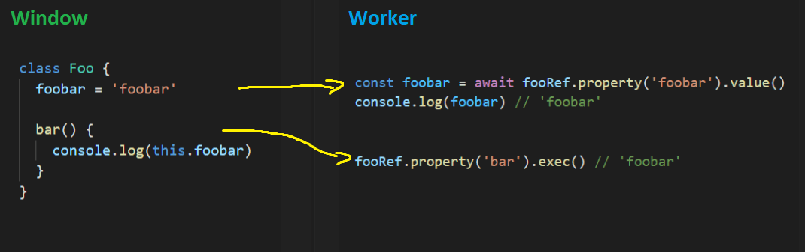

# JavaScript RPC Library

<b>Glue for Web Workers and iFrames</b>

This library serves to be a tiny (3kb), low level RPC implementation for JavaScript that allows for the interaction of values that exist in an external context. Think iframes and web workers.

<p align="center">
  <br>
  
  <i>Accesing something on the host page from a Worker<br>Can also work the other way around</i>
  <br>
</p>

## Sample Projects

For a practical example of how this works, sample projects are available in the [`sample-projects`](./sample-projects) folder.

These projects are also available for viewing hosted here:

- [iframe example](https://cdn.davidalsh.com/rpc/sample-projects/iframes/index.html)
- [web worker example](https://cdn.davidalsh.com/rpc/sample-projects/web-worker/index.html)


## Installation

### NPM

Pretty standard npm installation

```shell
npm install --save @alshdavid/rpc
```

Then import using ES Modules or CommonJS Modules <i>(Node 14+ allows for differential loading)</i>
```typescript
import { DataSource, Reference } from '@alshdavid/rpc'
const { DataSource, Reference } = require('@alshdavid/rpc')
```

### CDN

You can add this directly as a `<script>` tag on your page with:

```html
<script src="https://cdn.davidalsh.com/rpc/latest.js"></script>
<script>
  const { DataSource, Reference } = RPC
</script>
```

From Modules/Module Web Workers you can import the URL:

```javascript
import { DataSource, Reference } from 'https://cdn.davidalsh.com/rpc/latest.js'
```

For Web Workers that are not using modules you can use

```javascript
importScripts('https://cdn.davidalsh.com/rpc/latest.js')
const { DataSource, Reference } = RPC
```

Alternatively you can specify the version of the library in the URL:
```html
<script src="https://cdn.davidalsh.com/rpc/latest.js"></script>
<script src="https://cdn.davidalsh.com/rpc/2.0.1.js"></script>
<script src="https://cdn.davidalsh.com/rpc/next.js"></script>
```

## Library API

This is split into two halves: 

The `DataSource` is the entity that has the target data in it's native context and the `Reference` is the entity that is consuming and interacting with that data.

### Data Source

The `DataSource` simply exposes a variable. It can be an Object, string, function, etc.

```typescript
// Swap MessagePorts
const source = new DataSource(port1, { Expose: 'This' })
```

### Reference

The `Reference` acts like a cursor pointer to a segment of the data stored within the remote `DataSource`. It begins at the root level and can traverse the source.

```typescript
// Swap MessagePorts
const ref0 = new Reference(port2)
const ref1 = ref0.property('Expose')
const value = await ref1.value() // 'This'
```

#### Methods

The `Reference` interacts with the source data using methods that observe, call or move the cursor. 

```typescript
interface IReference {
  property(...pathSegments: string[]): IReference
  set(value: any): Promise<void>
  value(): Promise<unknown>
  exec(...args: any[]): Promise<IReference>
  release(): Promise<void>
}
```

Different data types are eligible for different methods, for example you can not run `exec()` on a `string` as it's not a callable type, but you can use it on a function or method.

|method|usage|
|-|-|
|`property`|This is used to traverse an object, it returns a new reference pointer to the path specified. <br><br>The originating reference pointer is kept, you can have multiple references. <br><br>Certain calls will result in cached values and those references must be manually released when done with them.
|`set`|This is used to set a property on an object to a certain value|
|`value`|This method will convert a `Reference` into the value held at that reference location. <br><br>It's important to remember that only serializable types can be transferred like this.<br><br>Fortunately, not all values need to be transferred. Remote function invocation can accept `Reference` types which the source will convert into the native values|
|`exec`|This method will invoke a method or function at the current `Reference` path.<br><br>It accepts simple serializable arguments like `string`, it accepts callback functions and `Reference` types as arguments.<br><br>It will return a `Reference` to it's return value.|
|`release`|This is used to purge the local and remote caches of values relevant to the current `Reference` cursor.<br><br>Failing to do this will result in memory leaks in both the remote and local contexts.|

## Use Cases

### Web Workers

A Web Worker may want access to the Window object on the host page. To do this, the host page will create a `DataSource` exposing the `window` object, then the worker will create a `Reference` to that, interacting with it as required.

Alternatively, if a Web Worker contains capabilities that the host page would like to interact with, then the Worker can create a `DataSource`, exposing the desired vales to the host page.

It's also possible for the host page and the Worker to both be consumers and data sources, cross exporting things on either side.

### iFrames

Similarly to Web Workers, cross origin iframes do not have access to the host page's Window object.

Using this library, it is possible to either export functionality from an iframe, consume functionality from a host page or both simultaneously.

### Catches

It's important to acknowledge that both entities (worker, iframe, host page) must have the RPC library installed and explicitly expose/consume capabilities from the other.

This does not give unlimited access to the `DataSource` context, only limited remote execution capabilities on an explicitly exported value.

## Callback function arguments

Functions that accepts functions as arguments are supported by this library.
_So yes, you can use function over a serialized boundary._

Below are some examples with their remote implementations described

```typescript
// const ref0 = () => 'Hello World'

const resultRef = await ref0.exec()
const value = await resultRef.value()

console.log(value) // 'Hello World'
```

```typescript
// const ref0 = (value) => value

const resultRef = await ref0.exec('Hello World')
const value = await resultRef.value()

console.log(value) // 'Hello World'
```

```typescript
// const ref0 = (callback) => callback()

await ref0.exec(() => {
  console.log('callback')
})
```

Function arguments that supply function arguments to the callback are also supported.
```typescript
// const nextFunc = () => {}
// const ref0 = (callback) => callback(nextFunc)

await ref0.exec(async nextRef => {
  await nextRef.exec()
})
```

#### Exceptions

Errors thrown in the data source are propagated to the consumer through the reference. The errors are references to the error in the data source.

```typescript
try {
  await ref0.exec()
} catch (errorRef) {
  const remoteMessage = await errorRef.reference.property('message').value()
  console.log(remoteMessage)
}
```

#### Realized values vs cursor traversal

Values are not transferred until `.value()`, `.set()` and (when arguments are supplied) `.exec()` are run. 

Generally, values are interacted with as references and are only transferred when the consumer requires their value within it's own context. If you attempt to transfer a type that is not serializable it will fail to send. The library will automatically convert/send callbacks to the data source as references when passed into `.exec()`, but more complex types like objects with functions will not work (at least not yet).

It may be required to write some small adapters/shims to facilitate smooth API access.

```typescript
// Data = { foo: { bar: { foobar: 'foobar' }}}

const ref1 = await ref0.property('foo') // Create reference with path
const ref2 = await ref1.property('bar', 'foobar') // Build it up

const foobar = await ref2.value() // Now get the value there 
```

#### Memory Management

There might be some improvements I can make here with time, but for now certain calls will incur a memory cost as certain values are stored on either side.

Things like function return values, callback function values, callback parameters, are all cached and must be manually purged when no longer needed

```typescript
// Data = () => 'Hello World'

const returnValueRef = await ref0.exec()
console.log(await returnValueRef.value()) // 'Hello World'

await returnValueRef.release() // Purge the cache for this return value

console.log(await returnValueRef.value()) // undefined
```

```typescript
// Data = (callback: (foo, bar) => void) => void

const returnValueRef = await ref0.exec(async (fooRef, barRef) => {
  console.log(await fooRef.value()) // 'foo'
  console.log(await barRef.value()) // 'bar'
})

ref0.release() // This will purge the 'foo' and 'bar' variables
```

### MessagePorts

The base API uses the browser `MessagePort` as the communication interface, so transfer your ports between your entities and you're good to go.

```typescript
import { Reference } from '@alshdavid/rpc'

const { port1, port2 } = new MessageChannel()

const iframe = document.createElement('iframe')
iframe.src = 'https://my-external-app'
iframe.contentWindow.postMessage('ports', '*', [port2])

const ref0 = new Reference(port1)
port1.start()
```


